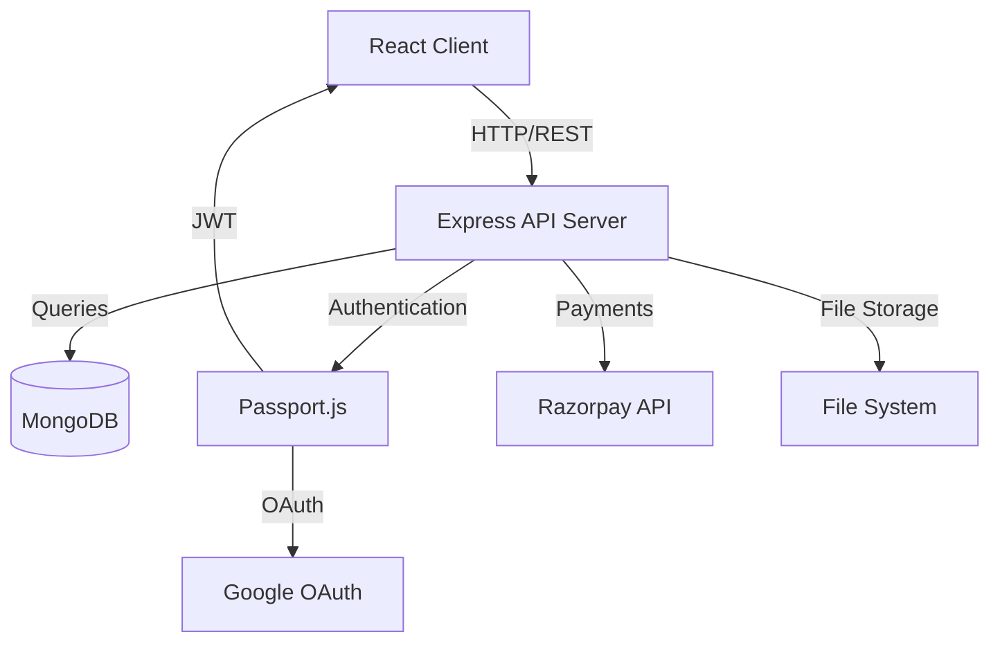
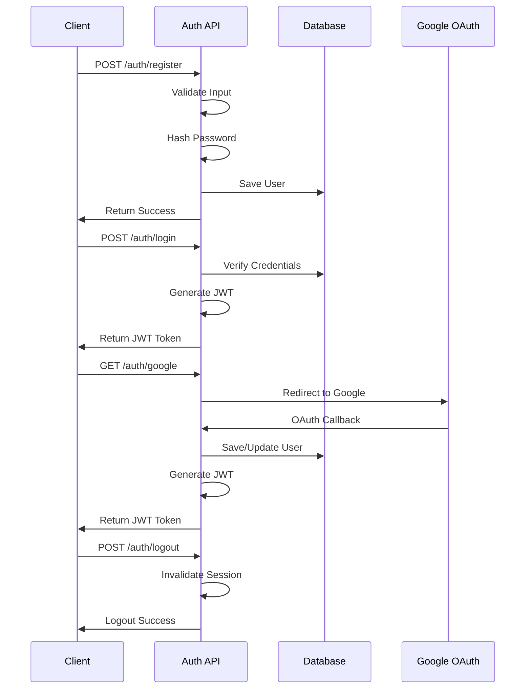
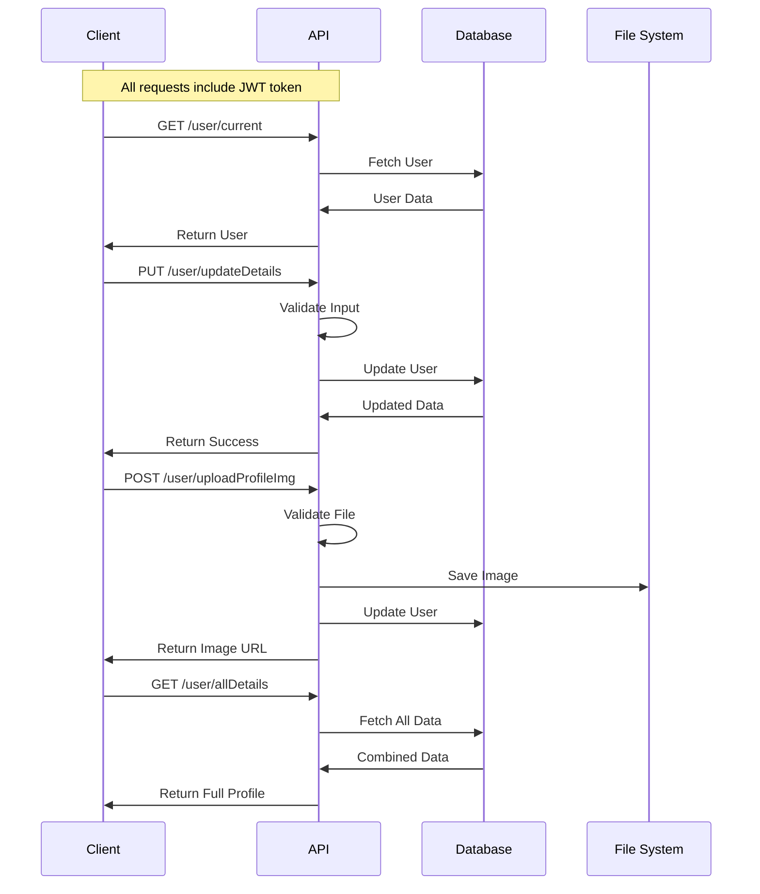
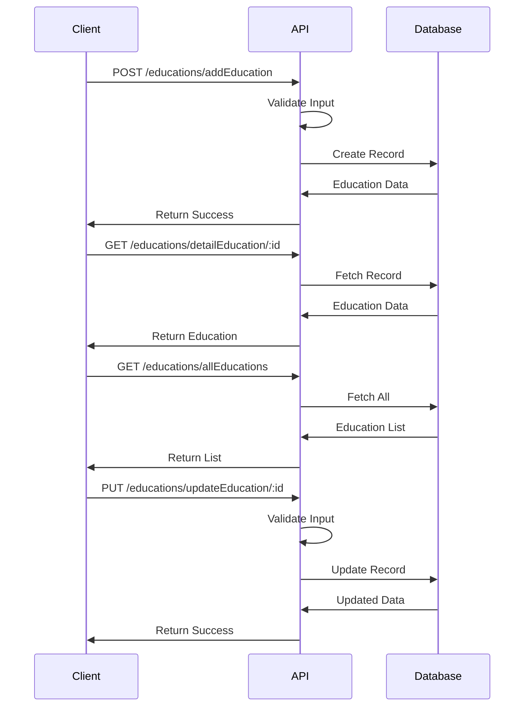
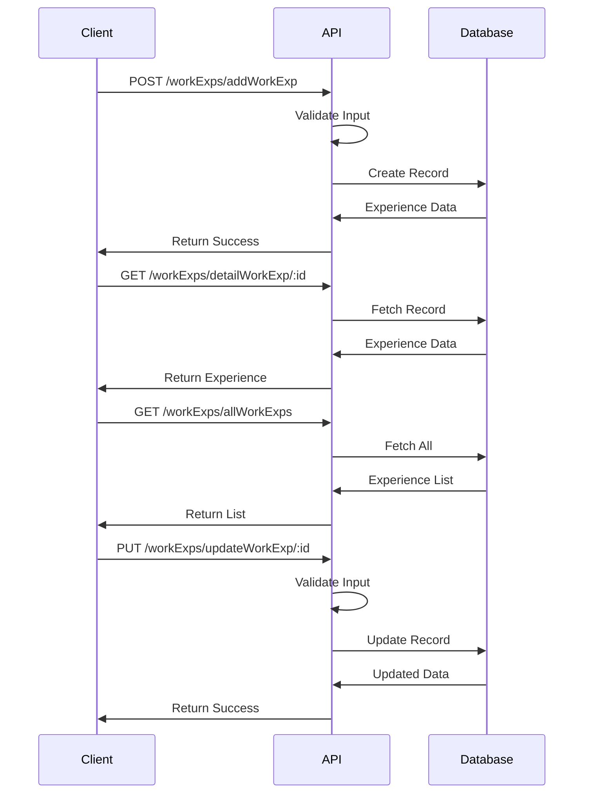
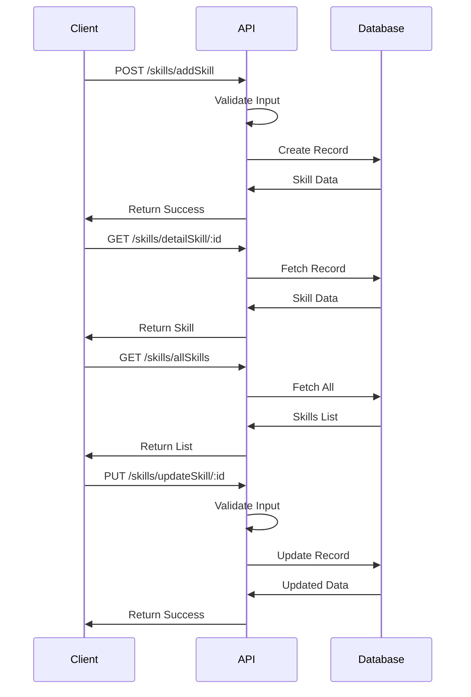
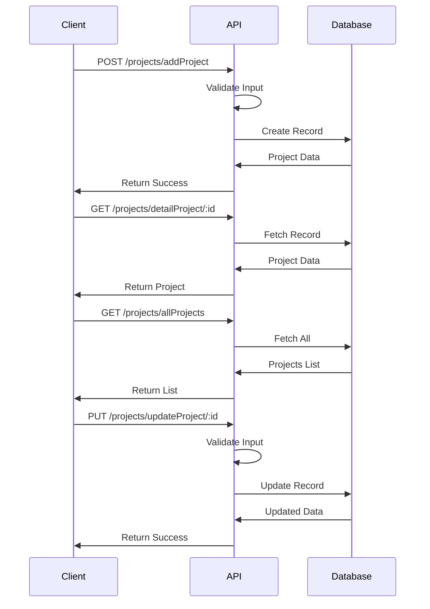
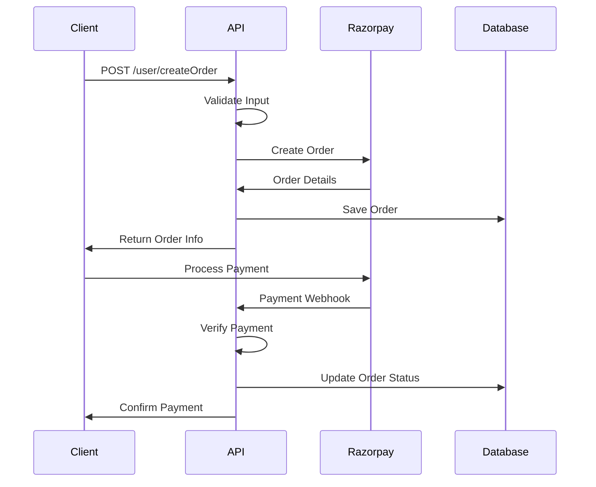

# CV Builder Application

A full-stack application for creating and managing professional resumes with a modern tech stack.

## Project Architecture

### Tech Stack

- **Frontend**: React + TypeScript + Vite
- **Backend**: Node.js + Express + TypeScript
- **Database**: MongoDB
- **Authentication**: Passport.js (JWT & Google OAuth)
- **Payment Integration**: Razorpay

### System Architecture Diagram



## API Documentation

### Base URL
```
BASE_URL: http://localhost:8000/api
```

### Authentication Endpoints

#### Authentication Flow



#### 1. User Registration
```http
POST /auth/register
Content-Type: application/json

{
    "email": "user@example.com",
    "password": "password123"
}
```

#### 2. User Login
```http
POST /auth/login
Content-Type: application/json

{
    "email": "user@example.com",
    "password": "password123"
}
```

#### 3. Google OAuth
```http
GET /auth/google
```

#### 4. Logout
```http
POST /auth/logout
```

### User Management Endpoints

#### User Management Flow



All these endpoints require JWT Authentication header:
```http
Authorization: Bearer <jwt_token>
```

#### 1. Get Current User
```http
GET /user/current
```

#### 2. Update User Details
```http
PUT /user/updateDetails
Content-Type: application/json

{
    "name": "John Doe",
    "email": "john@example.com"
}
```

#### 3. Upload Profile Image
```http
POST /user/uploadProfileImg
Content-Type: multipart/form-data

Form Data:
- profileImage: <file>
```

#### 4. Get Profile Image
```http
GET /user/profileImg
```

#### 5. Get All User Details
```http
GET /user/allDetails
```

#### 6. Get CV Templates
```http
GET /user/allCvTemplates
```

### User Details Management

#### 1. Add User Details
```http
POST /userDetails/addDetail
Content-Type: application/json

{
    "firstName": "John",
    "lastName": "Doe",
    "profession": "Software Engineer",
    "about": "Experienced developer..."
}
```

#### 2. Get User Details
```http
GET /userDetails/detail
```

#### 3. Update User Details
```http
PUT /userDetails/updateDetail
```

### Education Management

#### Education Flow



#### 1. Add Education
```http
POST /educations/addEducation
Content-Type: application/json

{
    "institution": "University Name",
    "degree": "Bachelor's",
    "field": "Computer Science",
    "startDate": "2020-09",
    "endDate": "2024-05",
    "grade": "3.8"
}
```

#### 2. Get Education Detail
```http
GET /educations/detailEducation/:id/get
```

#### 3. Get All Education
```http
GET /educations/allEducations
```

#### 4. Update Education
```http
PUT /educations/updateEducation/:id/update
```

### Work Experience Management

#### Work Experience Flow



#### 1. Add Work Experience
```http
POST /workExps/addWorkExp
Content-Type: application/json

{
    "company": "Company Name",
    "position": "Software Engineer",
    "startDate": "2020-01",
    "endDate": "2023-12",
    "description": "Responsibilities and achievements..."
}
```

#### 2. Get Work Experience Detail
```http
GET /workExps/detailWorkExp/:id/get
```

#### 3. Get All Work Experience
```http
GET /workExps/allWorkExps
```

#### 4. Update Work Experience
```http
PUT /workExps/updateWorkExp/:id/update
```

### Skills Management

#### Skills Flow



#### 1. Add Skill
```http
POST /skills/addSkill
Content-Type: application/json

{
    "name": "JavaScript",
    "level": "Expert"
}
```

#### 2. Get Skill Detail
```http
GET /skills/detailSkill/:id/get
```

#### 3. Get All Skills
```http
GET /skills/allSkills
```

#### 4. Update Skill
```http
PUT /skills/updateSkill/:id/update
```

### Project Management

#### Project Flow



#### 1. Add Project
```http
POST /projects/addProject
Content-Type: application/json

{
    "title": "Project Name",
    "description": "Project description",
    "technologies": ["React", "Node.js"],
    "startDate": "2023-01",
    "endDate": "2023-12"
}
```

#### 2. Get Project Detail
```http
GET /projects/detailProject/:id/get
```

#### 3. Get All Projects
```http
GET /projects/allProjects
```

#### 4. Update Project
```http
PUT /projects/updateProject/:id/update
```

### Payment Integration

#### Payment Flow



#### Create Order
```http
POST /user/createOrder
Content-Type: application/json

{
    "amount": 1000,
    "currency": "INR",
    "receipt": "order_receipt_1"
}
```

## Environment Variables

Create a `.env` file in the server directory with the following variables:

```env
NODE_ENV=development
PORT=8000
BASE_PATH=/api
MONGO_URL=your_mongodb_connection_string

JWT_SECRET=your_jwt_secret
JWT_EXPIRES_IN=1d

SESSION_SECRET=your_session_secret
SESSION_EXPIRES_IN=24h

GOOGLE_CLIENT_ID=your_google_client_id
GOOGLE_CLIENT_SECRET=your_google_client_secret
GOOGLE_CALLBACK_URL=http://localhost:8000/api/auth/google/callback

FRONTEND_ORIGIN=http://localhost:5173
FRONTEND_GOOGLE_CALLBACK_URL=http://localhost:5173/google/oauth/callback

Razorpay_KEY_ID=your_razorpay_key_id
Razorpay_KEY_SECRET=your_razorpay_key_secret
```

## Error Handling

The API uses standard HTTP status codes:
- 200: Success
- 201: Created
- 400: Bad Request
- 401: Unauthorized
- 403: Forbidden
- 404: Not Found
- 500: Internal Server Error

Error responses follow this format:
```json
{
    "message": "Error description",
    "error": "Optional detailed error information"
}
```

## Data Models

### User
- _id: ObjectId
- email: String
- password: String (hashed)
- provider: String (local/google)
- createdAt: Date
- updatedAt: Date

### UserDetail
- userId: ObjectId (ref: User)
- firstName: String
- lastName: String
- profession: String
- about: String
- contact: Object
- socialLinks: Object

### Education
- userId: ObjectId (ref: User)
- institution: String
- degree: String
- field: String
- startDate: Date
- endDate: Date
- grade: String

### Experience
- userId: ObjectId (ref: User)
- company: String
- position: String
- startDate: Date
- endDate: Date
- description: String
- responsibilities: Array

### Project
- userId: ObjectId (ref: User)
- title: String
- description: String
- technologies: Array
- startDate: Date
- endDate: Date
- links: Object

### Skill
- userId: ObjectId (ref: User)
- name: String
- level: String

## Security Measures

1. JWT Authentication for API endpoints
2. Password hashing
3. CORS configuration
4. Input validation using Zod
5. Rate limiting
6. Request sanitization
7. Secure file upload handling
8. Error handling middleware

## Getting Started

1. Clone the repository
2. Install dependencies:
```bash
# Install server dependencies
cd server
npm install

# Install client dependencies
cd ../client
npm install
```

3. Set up environment variables (see Environment Variables section)

4. Start the development servers:
```bash
# Start server (from server directory)
npm run dev

# Start client (from client directory)
npm run dev
```

## Contributing

1. Fork the repository
2. Create a feature branch
3. Commit your changes
4. Push to the branch
5. Create a Pull Request

## License

MIT License